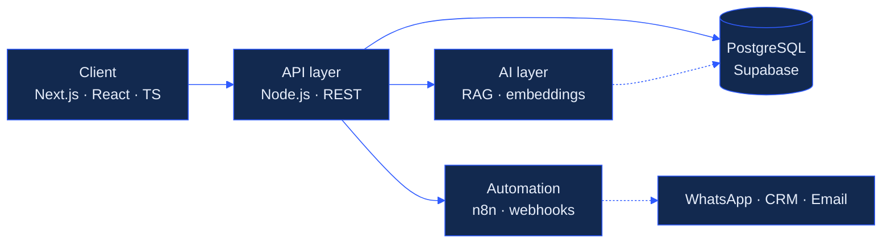

<picture>
  <source media="(prefers-color-scheme: dark)" srcset="./assets/header-dark.svg">
  <source media="(prefers-color-scheme: light)" srcset="./assets/header-light.svg">
  
</picture>

 

---

## The short version

I build the software that businesses actually run on — order flow, parcel tracking, cost control, invoicing — for companies in Latin America that have outgrown spreadsheets and can't afford enterprise suites.

I'm the founder and engineer at **bytelabs.**, which means I do discovery calls in the morning and ship to production in the afternoon. That's not a humblebrag; it's why my architecture decisions tend to be conservative. When you're the one who gets the 11pm call because a restaurant can't close its register, you stop reaching for clever.

---

## Featured work

| Product | What it solves | Built with |
| :--- | :--- | :--- |
| **Cobrix** | Restaurant and bar POS built for venues that lose internet three times a week — order lifecycle, split bills, pre-checks, and Panamanian electronic invoicing | React · NestJS · SQLite/Supabase · PM2 |
| **SwiftPOS** | Retail point of sale for small shops: inventory, sales, and the reporting an accountant actually asks for | Next.js · Supabase · PostgreSQL |
| **[Logistics OS](https://poboxweb.vercel.app/)** | Parcel tracking, cost control and margin visibility for freight operators who were running on WhatsApp and Excel | Next.js · Supabase · PostgreSQL |
| **[AI Knowledge Copilot](https://ai-knowledge-copilot-web.vercel.app/dashboard/)** | Turns a company's scattered internal documents into something you can ask questions to | RAG pipeline · vector search · OpenAI API |
| **[WhatsApp Lead Engine](https://whatsapp-automation-landing-olive.vercel.app/)** | Qualifies inbound leads and routes them into a CRM without anyone copy-pasting | n8n · webhooks · AI workflows |

---

## How the systems are shaped

Most of what I build follows the same spine. A thin client, a boring API, one source of truth, and the AI and automation layers bolted on the side where they can fail without taking the business down with them.

Cobrix is the clearest example: domain-driven design, optimistic locking on shared orders, idempotency keys per sub-account, and an event-sourced inventory ledger. It runs on-premise first and syncs to the cloud when there's a connection to sync with.

The dotted lines matter: if the AI layer or the automation layer goes down, orders still get taken and invoices still get issued. Degraded, not dead.

---

## Stack

| Layer | Tools |
| :--- | :--- |
| Product | Next.js, React, TypeScript, TailwindCSS |
| Backend | Node.js, NestJS, REST API design, webhooks |
| Data | PostgreSQL, Supabase, pgvector, event-sourced inventory |
| Applied AI | RAG architecture, OpenAI API, embeddings, prompt engineering |
| Automation | n8n, ManyChat, WhatsApp Business API |
| Infra | Vercel, DigitalOcean, PM2, Docker |

<b>Opinions I'll defend</b>

 

**Local-first before cloud-first, for on-premise clients.** A bar in Panama loses its internet three times a week. If the register stops when the connection does, the product is a demo. Sync is a background concern, not a dependency.

**Idempotency keys on anything that touches money.** Double-charging a customer costs more trust than a week of downtime.

**Optimistic locking over pessimistic.** Two waiters editing the same order is the normal case, not the edge case. Design for the collision instead of preventing it with a lock nobody remembers to release.

**Boring database, interesting application.** Postgres does more than most teams use. Reach for a second datastore only after the first one has genuinely failed you.

**Regulatory constraints are product requirements.** Electronic invoicing rules in Panama aren't paperwork to bolt on at the end — they shape the schema. Retrofit them and you rewrite the schema.

---

## Currently

- Shipping electronic invoicing on CobrIx — PAC integration, sandbox, then DGI production
- Working through **AWS Cloud Practitioner (CLF-C02)**
- Studying Systems Engineering at Universidad Interamericana de Panamá
- Open to talking about B2B SaaS architecture, applied AI, and LatAm market entry

---

  

<code>bytelabs.</code> — 09.0°N 79.7°W — Panama

